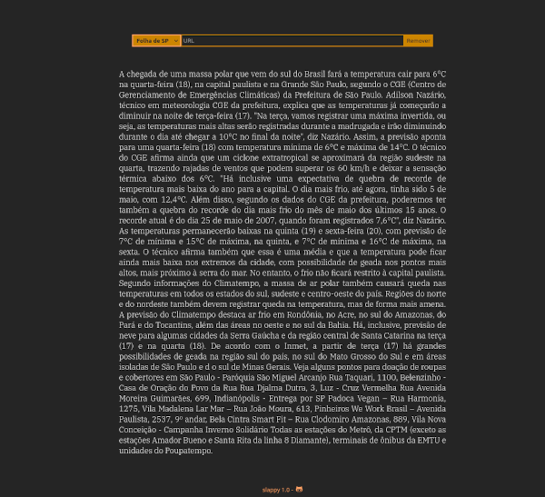

# slappy-web

### |EN-US|

Paywall bypasser built with node.js, cheerio and express-handlebars

a web version of [github.com/barbarabrito/slappy](https://github.com/barbarabrito/slappy)

Still a work in progress

### Instructions

To run the app locally:

```
npm run start
```
You must have node.js installed in your machine.

### |PT-BR|

Um burlador de paywall

Tecnologias utilizadas:

- node.js
- express.js
- cheerio
- express-handlebars

### Instruções

Para rodar o app localmente:

```
npm run start
```
Você precisa ter o node.js instalado no seu computador



